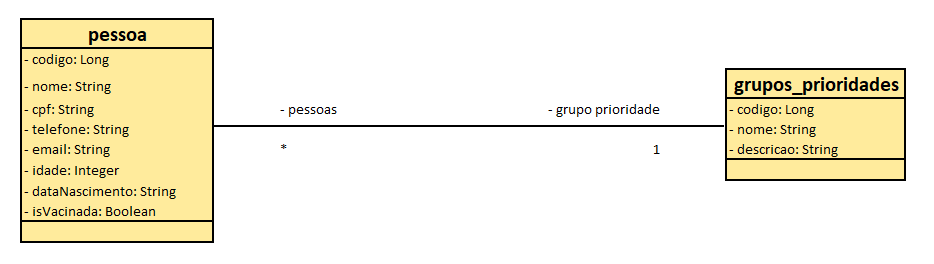

<h1 align="center">eVaccine</h1>

## Project

This project (eVaccine) consists of a mobile application where the user can register, a web application where you can track who has already taken the covid-19 vaccine and a back-end that is consumed by both applications.

## Technologies and Libraries

This project was developed with the following technologies/libraries:

- [PostgreSQL 12](https://www.postgresql.org/)
- [pgAdmin 4.28](https://www.pgadmin.org/)
- [Spring Tools Suite 4.9](https://spring.io/tools)
- [Spring Boot 2.5.1](https://spring.io/projects/spring-boot)
- [Java SE 11.0.11](https://www.oracle.com/br/java/technologies/javase-downloads.html)
- [Node.js v14.16.0](https://nodejs.org/en/)
- [React JS](https://reactjs.org/)
- [Ant Design 4.16.2](https://ant.design/)
- [Expo 4.3.4](https://expo.io/)

## Mobile Devices

- Android: API 28
- IOS: 14.6

## Layout
# Web Application

  

# Mobile Application

  

# Conceptual database model

  

## How to run

- Access the  pgAdmin;
- Create the database `evaccine` in the: Servers -> PostgreSQL 12 -> Databases;
- Create a folder to workspace;
- Access the workspace folder and clone the repository;
- Open the workspace folder in the STS IDE(Spring Tools Suite);
- Import the Back-end: File -> Import -> Maven -> Existing Maven Projects -> Browse.. -> access the cloned project folder and select `backend` folder -> Finish;
- Adjust database connection information in file: backend -> src/main/resources -> application.properties;
- Start the Back-end via the STS IDE(Spring Tools Suite);
- Back-end will run at `http://localhost:8080`;
- Create some registers in the `grupos_prioridades` table;
- Access the cloned project folder;
- Access `frontend` directory;
- Install dependencies with `npm install` or `yarn`;
- Start the Front-end with `npm start` or `yarn start`;
- Front-end will run at `http://localhost:3000`;
- Access mobile folder and install dependencies with `npm install` or `yarn`;
- Start Expo with `expo start`, `npm start` or `yarn start`;
- To execute mobile aplication in the a physical cellphone install Expo Go or use a emulator; 

## License

This project is under the MIT license. See the [LICENSE](LICENSE.md) file for more details.